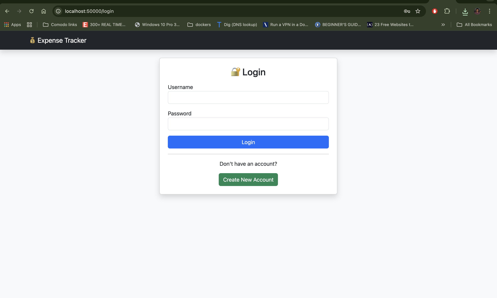
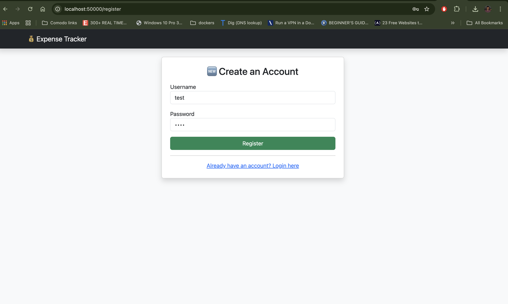
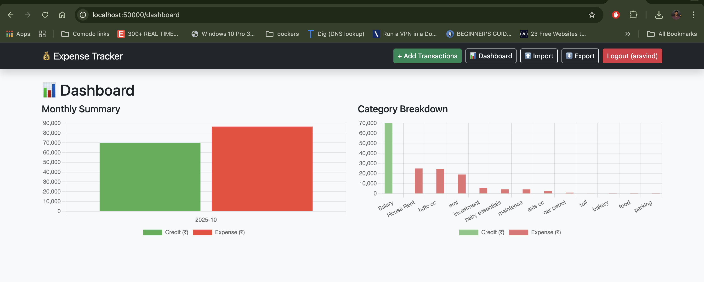

💰 Flask Expense Tracker

A simple, elegant, and production-ready Expense Tracker Web Application built using Flask, SQLite, and Chart.js, containerized with Docker.

It supports multiple users, tracks Credits and Expenses, and provides a visual dashboard with filters for analyzing income and spending trends.

🚀 Features

✅ User Authentication (Register, Login, Logout)
✅ Add / Edit / Delete Transactions
✅ Credit & Expense Support
✅ Date Range Filter for reports
✅ Category Filter for reports
✅ Dashboard with Charts (Chart.js)
✅ Category & Monthly Summaries
✅ CSV Import / Export
✅ Dockerized for Easy Deployment
✅ Persistent SQLite Database

🧩 Tech Stack
| Layer     | Technology                        |
| --------- | --------------------------------- |
| Backend   | Flask (Python 3.11)               |
| Database  | SQLite                            |
| Frontend  | Bootstrap + Chart.js              |
| Server    | Gunicorn + Nginx (for production) |
| Container | Docker / Docker Compose           |

⚙️ Environment Variables
| Variable     | Description                                      |
| ------------ | ------------------------------------------------ |
| `SECRET_KEY` | Flask session encryption key                     |
| `FLASK_ENV`  | Environment mode (`production` or `development`) |


⚙️ Installation (Docker)
1. Clone the repository:
git clone <repository-url>

cd expense-tracker

🐳 Docker Build & Run (Production)
1️⃣ Build the Docker Image
```bash
docker build -t expense-tracker .
```

2️⃣ Run the Container (Recommended Command)

```bash
docker run -d \
  --name expense-tracker \
  -p 50000:5000 \
  -e FLASK_ENV=production \
  -e SECRET_KEY=your-super-secret-key \
  -v $(pwd)/data:/app/data \
  -v $(pwd)/templates:/app/templates \
  --restart unless-stopped \
  expense-tracker
```

| Flag                                 | Purpose                                   |
| ------------------------------------ | ----------------------------------------- |
| `-d`                                 | Run in detached mode                      |
| `--name expense-tracker`             | Container name                            |
| `-p 50000:5000`                       | Maps container port 50000 → host port 5000 |
| `-v $(pwd)/data:/app/data`           | Persistent SQLite storage                 |
| `-v $(pwd)/templates:/app/templates` | Mount HTML templates for easy updates     |
| `--restart unless-stopped`           | Auto-restart container if stopped         |
| `-e SECRET_KEY`                      | Flask secret key for session management   |

3️⃣ Access the Application
Open your browser and navigate to `http://localhost:50000`


📊 Dashboard Overview

The dashboard provides:

Visual Charts comparing Credit vs Expense

Date Range Filtering for reports

Category and Monthly Summaries

Balance Summary: Income – Expense

Charts are powered by Chart.js and update dynamically with filters.

Stop the Container
To stop the running container, use:
```bash
docker stop expense-tracker
```
Remove the Container
To remove the container, use:
```bash
docker rm expense-tracker
```





